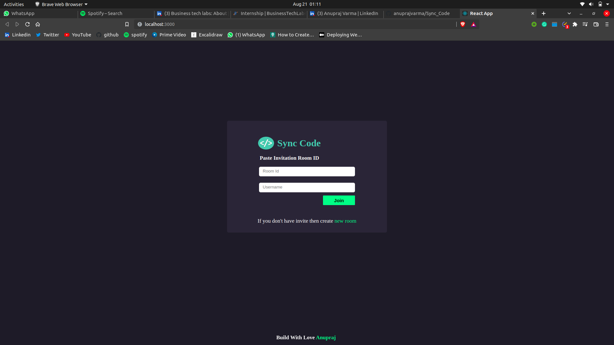
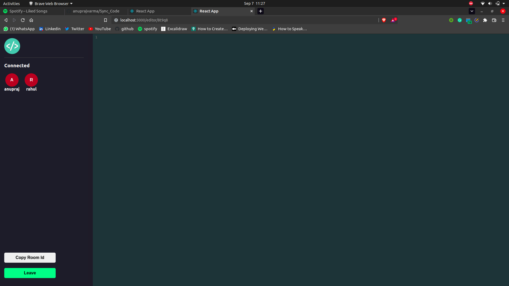

### ***Sync_Code***
---
#### *This is a paint application built with MERN stack which has the functionality of login and sign up. It is integrated with MongoDB to store user info.*

---

#### ***Technologies used:***
> ***Frontend***
* ***ReactJs***
* ***Socket.io-client as Web-socket client***

> ***Backend***
* ***NodeJs***
* ***ExpressJs***
* ***MongoDB***
* ***Socket.io for Web-socket communication***

> ***Snapshot of app:*** 

